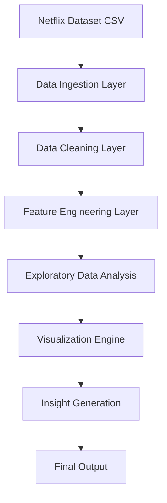

# Netflix Data Analysis

## Project Overview

This project analyzes Netflix's catalog of Movies and TV Shows using Python and Pandas. The objective is to identify trends in content production, genre distribution, country-wise contribution, and platform growth.

## Technologies Used

- Python
- Pandas
- NumPy
- Matplotlib
- Seaborn
- Jupyter Notebook

## Dataset

Netflix Movies and TV Shows Dataset from Kaggle.

## Features

- Data Cleaning
- Missing Value Handling
- Duplicate Removal
- Exploratory Data Analysis (EDA)
- Data Visualization
- Trend Analysis

## Key Insights

- Movies dominate Netflix's content library.
- The United States contributes the highest amount of content.
- Netflix content growth accelerated after 2015.
- Drama is one of the most popular genres.

## Visualizations

- Movies vs TV Shows
- Top 10 Countries
- Top Genres
- Content Added by Year

## Final Architecture

            ## Final Architecture

